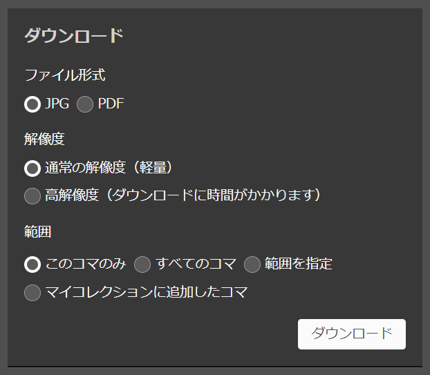

# ndldc

本ソフトウェアを使用することで、国立国会図書館デジタルコレクション / National Diet Library Digital Collectionsから資料の画像をダウンロードできます。

国立国会図書館デジタルコレクションにおいて、ログインなしで閲覧可能な資料については、本ソフトウェアを使用しなくても、資料ページ右下のメニューからJPG/PDFをダウンロードすることができます。

<div align="center">
    
</div>

本ソフトウェアは、このメニューからは利用できない、以下の機能を提供します。

- 個人送信でしか閲覧できない資料のダウンロード
- 資料の画像を目次付きのPDFに変換してダウンロード（2022年12月現在、公式からダウンロードできるPDFには目次が付いていません）

## 使い方

1. （個人送信でしか閲覧できない資料をダウンロードする場合のみ）個人送信に登録します。
登録方法については[こちらのページ](https://www.ndl.go.jp/jp/use/digital_transmission/individuals_index.html)を参照してください。
（ちなみに、手続きはすべてオンラインで行うことができ、申請から登録完了まで数日かかります。）

1. Poetryをインストールします。
インストール方法については[こちらのページ](https://python-poetry.org/docs/#installation)を参照してください。

1. 本リポジトリをcloneします。
    ```bash
    git clone git@github.com:ishioka0222/ndldc.git
    ```

1. 依存パッケージをインストールします。
    ```bash
    cd ndldc
    poetry install --no-dev
    ```

1. 本ソフトウェアの`download`サブコマンドを実行します。
    引数には、ダウンロードしたい資料のURLを指定します。
    ```bash
    poetry run ndldc download https://dl.ndl.go.jp/pid/922693/1/1
    ```
    `--pdf`オプションを指定すると、ダウンロードされた資料が目次付きのPDFで保存されます。
    ```bash
    poetry run ndldc download --pdf https://dl.ndl.go.jp/pid/922693/1/1
    ```
    個人送信でしか閲覧できない資料をダウンロードする場合、個人送信に登録した際のユーザー名とパスワードを`--username`および`--password`オプションで指定します。
    ```bash
    poetry run ndldc download --username ユーザー名 --password パスワード https://dl.ndl.go.jp/pid/1371110/1/1
    ```

## ライセンス

[LICENSE.txt](LICENSE.txt)を参照してください。

## 連絡先

<dl>
    <dt>メールアドレス</dt>
    <dd>ishioka0222 at gmail.com</dd>
</dl>
